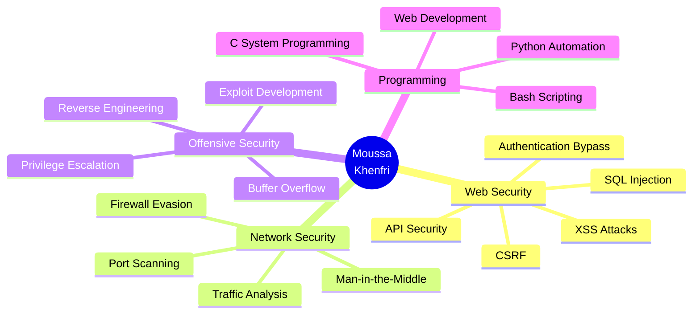

# 👨‍💻 Moussa Khenfri | Cybersecurity Researcher & Ethical Hacker

<div align="center">

```ascii
╔═══════════════════════════════════════════════════════════════╗
║                                                               ║
║   ███╗   ███╗ ██████╗ ██╗   ██╗███████╗███████╗ █████╗      ║
║   ████╗ ████║██╔═══██╗██║   ██║██╔════╝██╔════╝██╔══██╗     ║
║   ██╔████╔██║██║   ██║██║   ██║███████╗███████╗███████║     ║
║   ██║╚██╔╝██║██║   ██║██║   ██║╚════██║╚════██║██╔══██║     ║
║   ██║ ╚═╝ ██║╚██████╔╝╚██████╔╝███████║███████║██║  ██║     ║
║   ╚═╝     ╚═╝ ╚═════╝  ╚═════╝ ╚══════╝╚══════╝╚═╝  ╚═╝     ║
║                                                               ║
║              K H E N F R I   //   S Y S T E M                 ║
║                                                               ║
╚═══════════════════════════════════════════════════════════════╝
```


```bash
[root@moussa]~# cat /etc/motd
━━━━━━━━━━━━━━━━━━━━━━━━━━━━━━━━━━━━━━━━━━━━━━━━━━━━━━
 Welcome to Moussa's Cybersecurity Lab
 System Status: ONLINE | Threat Level: GREEN
 Last Login: From the matrix...
━━━━━━━━━━━━━━━━━━━━━━━━━━━━━━━━━━━━━━━━━━━━━━━━━━━━━━
```

[](https://www.linkedin.com/in/moussa-khenfri-b24481320)
[](https://x.com/KhanfriMoussa)
[](mailto:moussakhanfri@gmail.com)
[](https://github.com/moussakh189)
[](https://github.com/moussakh189)

</div>

---

## 🎯 ./initialize.sh

<div align="center">

```bash
┌──────────────────────────────────────────────────────────────┐
│ SYSTEM INITIALIZATION SEQUENCE                               │
├──────────────────────────────────────────────────────────────┤
│ [████████████████████████████] 100%                          │
│                                                              │
│ > Loading user profile...                    [OK]           │
│ > Establishing secure connection...          [OK]           │
│ > Initializing hacking modules...            [OK]           │
│ > Mounting cyber arsenal...                  [OK]           │
│                                                              │
│ SYSTEM READY. TYPE 'help' FOR AVAILABLE COMMANDS.           │
└──────────────────────────────────────────────────────────────┘
```

</div>

```python
#!/usr/bin/env python3
# -*- coding: utf-8 -*-

"""
╔══════════════════════════════════════════════════════════════╗
║  AUTHOR: Moussa Khenfri                                      ║
║  ROLE: Cybersecurity Student & Penetration Tester            ║
║  LOCATION: Algeria 🇩🇿                                        ║
║  STATUS: Hunting bugs, writing exploits, breaking things     ║
╚══════════════════════════════════════════════════════════════╝
"""

class EthicalHacker:
    def __init__(self):
        self.name = "Moussa Khenfri"
        self.role = "Cybersecurity Student"
        self.location = "Algeria 🇩🇿"
        self.mindset = "Hack the planet, but make it ethical"
        
        self.arsenal = {
            "languages": ["Python", "C", "PHP", "Bash", "SQL", "JavaScript"],
            "specialties": [
                "Web Application Security",
                "Penetration Testing", 
                "Network Security",
                "OSINT & Reconnaissance",
                "Exploit Development"
            ],
            "tools": [
                "Burp Suite", "Metasploit", "Nmap", "SQLMap",
                "Wireshark", "Netcat", "John the Ripper"
            ],
            "os": ["Kali Linux", "Parrot OS", "Ubuntu"],
            "frameworks": ["OWASP Top 10", "MITRE ATT&CK", "PTES"]
        }
    
    def status(self):
        return {
            "current_mission": "Mastering offensive security techniques",
            "mode": "Learning | Building | Breaking",
            "availability": "Open for collaboration & bug bounties",
            "coffee_level": "Critical ☕☕☕"
        }
    
    def get_motto(self):
        return "Control is an illusion. But vulnerabilities are very real."

# Initialize hacker instance
hacker = EthicalHacker()
print(f"[+] System loaded: {hacker.name}")
print(f"[+] Mission: {hacker.status()['current_mission']}")
print(f"[+] Motto: {hacker.get_motto()}")
```

```bash
[root@moussa]~# ./status.sh

┌─[SYSTEM STATUS]─────────────────────────────────────┐
│                                                     │
│  🟢 Active Mode     : Offensive Security            │
│  🎯 Current Focus   : Web Exploitation              │
│  📚 Learning        : Advanced Binary Exploitation  │
│  🔥 Streak          : 100+ days coding              │
│  💻 Projects        : 15+ security tools            │
│  📝 Write-ups       : 50+ CTF solutions             │
│                                                     │
└─────────────────────────────────────────────────────┘
```

> *"When you don't create things, you become defined by your tastes rather than ability."* — Mr. Robot

---

## 🛠️ ./tech_stack.sh

<div align="center">

```bash
[root@moussa]~# cat ~/.tech_stack/weapons.list
━━━━━━━━━━━━━━━━━━━━━━━━━━━━━━━━━━━━━━━━━━━━━━━
            CYBER ARSENAL v2.0
━━━━━━━━━━━━━━━━━━━━━━━━━━━━━━━━━━━━━━━━━━━━━━━
```

### 💻 Programming & Scripting


### 🔒 Security & Penetration Testing


### 🌐 Web Technologies


### 🐧 Operating Systems & Environments


```bash
[✓] Arsenal loaded successfully
[✓] All systems operational
[✓] Ready for engagement
```

</div>

---

## 📊 ./analytics.sh

<div align="center">

```bash
[root@moussa]~# python3 stats_analyzer.py
━━━━━━━━━━━━━━━━━━━━━━━━━━━━━━━━━━━━━━━━━━━━━━━
         GITHUB METRICS DASHBOARD
━━━━━━━━━━━━━━━━━━━━━━━━━━━━━━━━━━━━━━━━━━━━━━━
```


```bash
[INFO] Data collection complete
[INFO] Metrics generated successfully
```

</div>

---

## 🎯 ./mission_control.sh

```bash
┌─[MISSION CONTROL CENTER]────────────────────────────────┐
│                                                          │
│  ACTIVE OPERATIONS:                                      │
│                                                          │
│  ┌──────────────────────────────────────────────────┐  │
│  │ [█████████████████████░░░░] 85% Web Security     │  │
│  │ [████████████████████░░░░░] 90% Python Mastery   │  │
│  │ [███████████████████████░░] 95% Linux Admin      │  │
│  │ [███████████████░░░░░░░░░░] 70% Binary Exploits  │  │
│  │ [████████████████░░░░░░░░░] 75% Network Security │  │
│  │ [██████████████░░░░░░░░░░░] 65% Reverse Eng.     │  │
│  └──────────────────────────────────────────────────┘  │
│                                                          │
└──────────────────────────────────────────────────────────┘
```

<div align="center">



</div>

---

## 📂 ./repository_structure.sh

```bash
[root@moussa]~# tree ~/github/projects -L 1

~/github/projects
├── 🔬 Labs-and-Writeups/
│   ├── TryHackMe-Solutions/
│   ├── HackTheBox-Writeups/
│   ├── CTF-Challenges/
│   ├── Bug-Bounty-Reports/
│   └── Vulnerability-Research/
│
├── 🛠️ Security-Tools/
│   ├── Web-Scanners/
│   ├── Exploit-Scripts/
│   ├── Recon-Tools/
│   ├── Password-Crackers/
│   └── Network-Analyzers/
│
├── 📚 Learning-Resources/
│   ├── Cybersecurity-Roadmap/
│   ├── OWASP-Guides/
│   ├── Cheat-Sheets/
│   ├── Certification-Notes/
│   └── Study-Materials/
│
└── 🌐 Web-Projects/
    ├── Secure-Auth-System/
    ├── Portfolio-Website/
    ├── API-Development/
    └── Security-Demos/

[INFO] Repository structure generated
[SUCCESS] All directories accessible
```

---

## 🚀 ./active_projects.sh

<div align="center">

```bash
[root@moussa]~# ps aux | grep projects
━━━━━━━━━━━━━━━━━━━━━━━━━━━━━━━━━━━━━━━━━━━━━━━━━━━━━━━━━━━━━━━━
                    ACTIVE PROJECTS STATUS
━━━━━━━━━━━━━━━━━━━━━━━━━━━━━━━━━━━━━━━━━━━━━━━━━━━━━━━━━━━━━━━━
```

| Project | Description | Stack | Status | Priority |
|---------|-------------|-------|--------|----------|
| 🔍 **VulnHunter** | Automated vulnerability scanner | Python, Requests | 🟢 ACTIVE | HIGH |
| 🛡️ **SecureAuth** | Multi-factor authentication | Node.js, JWT | 🟡 DEV | MEDIUM |
| 📝 **CTF-Arsenal** | CTF tools & solutions | Python, Bash | 🟢 ACTIVE | HIGH |
| 🔐 **HashCracker** | Multi-algorithm password tool | C, OpenMP | 🟡 DEV | MEDIUM |
| 🌐 **WebPwn** | Web exploitation framework | Python, Flask | 🔴 PLANNED | HIGH |
| 🕵️ **OSINTify** | OSINT gathering toolkit | Python, APIs | 🟡 DEV | MEDIUM |

```bash
[6] total projects
[2] active | [3] in development | [1] planned
```

</div>

---

## 🎓 ./learning_path.sh

```bash
[root@moussa]~# cat ~/learning/roadmap.txt

╔══════════════════════════════════════════════════════════════╗
║              CYBERSECURITY LEARNING ROADMAP                  ║
╚══════════════════════════════════════════════════════════════╝

PHASE 1: FOUNDATIONS ━━━━━━━━━━━━━━━━━━━━━━━━━━━━ [COMPLETED]
[✓] Linux Fundamentals
[✓] Networking Basics (TCP/IP, OSI Model)
[✓] Python Programming
[✓] Web Technologies (HTML, CSS, JavaScript)
[✓] SQL & Database Fundamentals

PHASE 2: SECURITY CORE ━━━━━━━━━━━━━━━━━━━━━━━━━ [IN PROGRESS]
[✓] OWASP Top 10
[✓] Web Application Security
[✓] Linux Privilege Escalation
[⚡] Binary Exploitation Basics
[⚡] Reverse Engineering Introduction
[→] Malware Analysis Fundamentals

PHASE 3: ADVANCED TOPICS ━━━━━━━━━━━━━━━━━━━━━━━ [UPCOMING]
[→] Advanced Exploit Development
[→] Active Directory Attacks
[→] Cloud Security (AWS/Azure)
[→] Mobile Application Security
[→] IoT Security

CERTIFICATIONS TRACK:
[✓] TryHackMe - Complete Beginner Path
[✓] HackTheBox - Starting Point
[⚡] eJPT - Preparation
[→] OSCP - Target for 2025
[→] CRTP - Advanced Goal

━━━━━━━━━━━━━━━━━━━━━━━━━━━━━━━━━━━━━━━━━━━━━━━━━━━━━━━━━━━━━━
Legend: [✓] Complete | [⚡] In Progress | [→] Planned
━━━━━━━━━━━━━━━━━━━━━━━━━━━━━━━━━━━━━━━━━━━━━━━━━━━━━━━━━━━━━━
```

---

## 🏆 ./achievements.sh

<div align="center">

```bash
[root@moussa]~# ./display_badges.py
━━━━━━━━━━━━━━━━━━━━━━━━━━━━━━━━━━━━━━━━━━━━━━━
         CERTIFICATIONS & ACHIEVEMENTS
━━━━━━━━━━━━━━━━━━━━━━━━━━━━━━━━━━━━━━━━━━━━━━━
```

| Badge | Title | Status | Date |
|-------|-------|--------|------|
| 🎯 | TryHackMe - Complete Beginner | ✅ EARNED | 2024 |
| 🏴‍☠️ | HackTheBox - Starting Point | ✅ EARNED | 2024 |
| 🔐 | OWASP Web Security Testing | 🟡 IN PROGRESS | 2025 |
| ⚔️ | 50+ CTF Challenges Solved | ✅ EARNED | 2024 |
| 💻 | 100+ Day Coding Streak | ✅ EARNED | 2024 |
| 🎓 | eJPT Certification | 📅 PLANNED | Q2 2025 |

```bash
[SUCCESS] 4 badges unlocked
[INFO] 2 in progress
```

</div>

---

## 💭 ./philosophy.sh

```bash
[root@moussa]~# cat ~/.motd/hacker_philosophy.txt

╔══════════════════════════════════════════════════════════════╗
║                                                              ║
║  "Hello, friend. Hello, friend? That's lame.                ║
║   Maybe I should give you a name...                         ║
║   But that's a slippery slope.                              ║
║   You're only in my head. We have to remember that..."      ║
║                                           — Mr. Robot        ║
║                                                              ║
╚══════════════════════════════════════════════════════════════╝

┌─────────────────────────────────────────────────────────────┐
│                                                             │
│  MY HACKER'S MANIFESTO:                                     │
│                                                             │
│  » Break things to understand them                          │
│  » Always hack ethically and legally                        │
│  » Knowledge should be shared freely                        │
│  » Every vulnerability is a lesson                          │
│  » Security through obscurity is not security               │
│  » Stay curious, stay humble, stay hungry                   │
│                                                             │
└─────────────────────────────────────────────────────────────┘

while true; do
    discover_vulnerability()
    exploit_responsibly()
    document_findings()
    share_knowledge()
    build_better_defenses()
    repeat()
done
```

---

## 📡 ./connect.sh

<div align="center">

```bash
[root@moussa]~# ./establish_connection.sh
━━━━━━━━━━━━━━━━━━━━━━━━━━━━━━━━━━━━━━━━━━━━━━━
         ESTABLISHING SECURE CONNECTION
━━━━━━━━━━━━━━━━━━━━━━━━━━━━━━━━━━━━━━━━━━━━━━━

[+] Initiating handshake...
[+] Encryption: AES-256
[+] Protocol: TLS 1.3
[+] Status: CONNECTED ✓

Available channels:
```

[](https://www.linkedin.com/in/moussa-khenfri-b24481320)
[](https://x.com/KhanfriMoussa)
[](mailto:moussakhanfri@gmail.com)
[](https://github.com/moussakh189)

```bash
━━━━━━━━━━━━━━━━━━━━━━━━━━━━━━━━━━━━━━━━━━━━━━━

💬 OPEN TO:
   ├─ Security Research Collaborations
   ├─ CTF Team Formations
   ├─ Bug Bounty Partnerships
   ├─ Open Source Contributions
   └─ Knowledge Exchange & Mentorship

📧 PGP: Available upon request
🔐 Security: Always use encrypted channels for sensitive data

━━━━━━━━━━━━━━━━━━━━━━━━━━━━━━━━━━━━━━━━━━━━━━━
```

</div>

---

## 🎬 ./end_sequence.sh

<div align="center">

```bash
[root@moussa]~# ./shutdown.sh --message

╔══════════════════════════════════════════════════════════════╗
║                                                              ║
║              THANK YOU FOR VISITING MY PROFILE               ║
║                                                              ║
║  "The bug you don't find today might be the exploit         ║
║   that compromises your system tomorrow."                   ║
║                                                              ║
║  Stay curious. Stay ethical. Stay caffeinated. ☕           ║
║                                                              ║
╚══════════════════════════════════════════════════════════════╝

┌─────────────────────────────────────────────────────────────┐
│  > Logging activity...                              [OK]    │
│  > Saving session data...                           [OK]    │
│  > Clearing terminal buffer...                      [OK]    │
│  > Awaiting next connection...                      [OK]    │
└─────────────────────────────────────────────────────────────┘
```


```ascii
     _____________________________________________________
    /                                                     \
   |  💀 Remember: In God we trust, all others we monitor  |
   |                                                       |
   |  If you find my work valuable, drop a ⭐ on my repos! |
    \_____________________________________________________/
            \   ^__^
             \  (oo)\_______
                (__)\       )\/\
                    ||----w |
                    ||     ||
```

```bash
[root@moussa]~# echo "Until next time, friend..." && exit

Until next time, friend...
Connection closed by remote host.
━━━━━━━━━━━━━━━━━━━━━━━━━━━━━━━━━━━━━━━━━━━━━━━━━━━━━━━━━━━━━━
```

</div>

---

<div align="center">

```bash
[SYSTEM] Session terminated
[INFO] Profile v2.0 loaded successfully
[STATUS] All systems operational
[root@moussa]~# _
```


</div>
